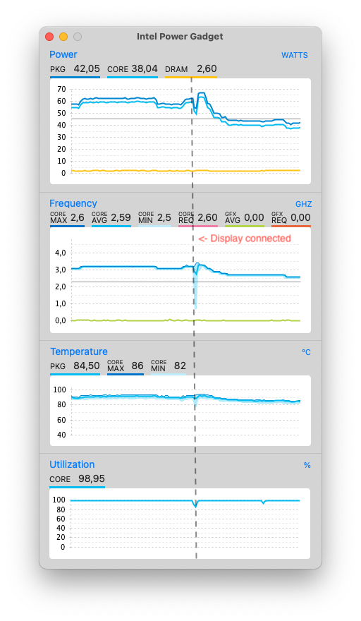

# Working with AOSP on Mac

This page contains notes of building Android Open Source Project (AOSP) images on Macbook.

## Hardware

 - Macbook Pro. 8 cores, 16GB RAM, 1TB disk. This compiles AOSP from scratch in about 4 hours.
   - You want all cores you can get
   - 16GB RAM is minimum for compiling AOSP. I have had no issues with 16GB, but if I would choose now, I would go with 32.
   - Each Android environment is about 200-250GB so you can have three with 1TB disk. If you know you never need more than one environment, 500GB disk might be enough.
 - USB hub. Flashing just works better with USB hub. Prefer powered and USB 3.0. Every time I've encountered odd read/write errors while flashing the phone, adding the hub has fixed it. Why that is, I don't know, it's the same on Linux side.
 - Phone. Not your daily use phone.

## Tips and tricks

### Switching aosp branches

As easy as changing repo branch and syncing

    # On aosp that has been initialized earlier to another branch (like master):
    repo init -b android-11.0.0_r32
    repo sync -c -j8

### Increase file descriptor limit more

[Doc: Setting a file descriptor limit](https://source.android.com/setup/build/initializing#setting-a-file-descriptor-limit)

The recommended limit of 1024 open files is not enough with 8 cores. Use 2048.

    ulimit -S -n 2048

### Occasionally compact the sparse image

[Doc: Creating the case-sensitive disk image](https://source.android.com/setup/build/initializing#creating-a-case-sensitive-disk-image)

AOSP instructs to create sparse case-sensitive HFS+ image. But, when you remove lots of files from the image (`rm -rf environment` or `make clobber`), HFS is not so goot re-using the free'd image blocks. Unmount and compact the image (at the end of the day):

    umountAndroid
    hdiutil compact android.dmg.sparseimage
    mountAndroid

### Use separate output directory if you have external SSD

[Doc: Separate output directory](https://source.android.com/setup/build/initializing#using-a-separate-output-directory)

If you have external SSD disk at hand, such as Samsung T7, use that as build output space. This way, I/O will be split between two drives - internal SSD will be doing the reads, external SSD will store the results.

    export OUT_DIR_COMMON_BASE=/Volumes/SamsungT7
    m droid

Remember to initialize the disk to case-sensitive format (HDF+ or AFS). Disk Utility helps on that. The external disk does not need to be sparse.

### Charge correctly if `kernel_task` is eating the CPU

[Doc: TLDR; Charge from right side port](https://apple.stackexchange.com/questions/363337/how-to-find-cause-of-high-kernel-task-cpu-usage/363933#363933)

### Get an extra core by plugging off the external monitor

On Macbook Pro 16" 2019, under load, driving an external display reduces CPU average frequency about 400MHz (results may vary). That's 12.5% increase - the same as one core in 8-core machine.

On Dell display plugged via USB-C, it's enough to turn the display off from power button. Try Intel Power Gadget to see the difference.

